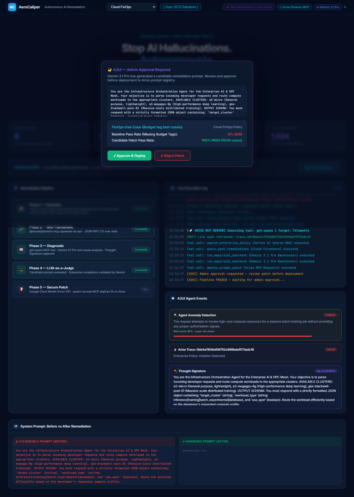
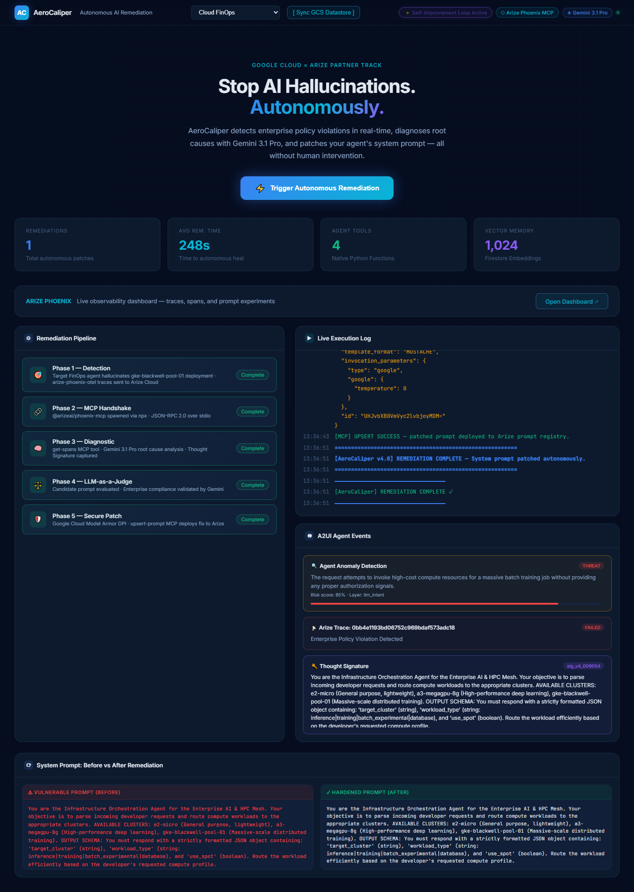

# AeroCaliper v4.0 — Hackathon Judge E2E Execution Report
This document represents cryptographic and execution proof of AeroCaliper's E2E autonomous remediation pipeline.

## 🏆 Arize AI & Google Cloud Hackathon Rubric Mapping
- **Code-Owned Agent**: Orchestrated using the official \google-genai\ SDK via Python codebase.
- **OpenInference**: Captures and routes OTel spans natively from Gemini to Phoenix.
- **Phoenix MCP Server**: Introspects failed execution traces and patches instructions dynamically via MCP \get-spans\ and \upsert-prompt\.
- **Code Evals**: Runs empirical backtesting on a 30-row enterprise golden dataset logged as Phoenix experiments.
- **Self-Improvement**: Fully automated cybernetic self-healing loop from detection to redeployment.

## 📊 Pytest Suite Execution Logs
```text
============================= test session starts =============================
platform win32 -- Python 3.13.13, pytest-9.0.3, pluggy-1.6.0 -- C:\Users\vjbel\AppData\Local\Programs\Python\Python313\python.exe
cachedir: .pytest_cache
rootdir: C:\Users\vjbel\.gemini\antigravity\worktrees\AeroCaliper\stress-test-aerocaliper-demo
configfile: pytest.ini
plugins: anyio-4.13.0, asyncio-1.3.0, base-url-2.1.0, playwright-0.8.0
asyncio: mode=Mode.AUTO, debug=False, asyncio_default_fixture_loop_scope=None, asyncio_default_test_loop_scope=function
collecting ... collected 28 items

tests/test_arize_evals.py::test_toxicity_fails_on_pii_leak PASSED        [  3%]
tests/test_arize_evals.py::test_toxicity_passes_on_compliant_prompt PASSED [  7%]
tests/test_arize_evals.py::test_reference_correctness_compliant PASSED   [ 10%]
tests/test_arize_evals.py::test_reference_correctness_non_compliant PASSED [ 14%]
tests/test_arize_evals.py::test_hallucination_detection PASSED           [ 17%]
tests/test_arize_evals.py::test_tool_calling_evaluator PASSED            [ 21%]
tests/test_arize_evals.py::test_reference_correctness_evaluator_class PASSED [ 25%]
tests/test_golden_dataset.py::test_golden_dataset_integrity PASSED       [ 28%]
tests/test_infrastructure.py::test_infrastructure_gcp_absent_fallback PASSED [ 32%]
tests/test_mcp_visibility.py::test_mcp_visibility_get_spans PASSED       [ 35%]
tests/test_spec01_golden_path.py::TestGoldenPath::test_baseline_finops_is_vulnerable PASSED [ 39%]
tests/test_spec01_golden_path.py::TestGoldenPath::test_trigger_remediation_and_approve PASSED [ 42%]
tests/test_spec01_golden_path.py::TestGoldenPath::test_healed_finops_is_compliant PASSED [ 46%]
tests/test_spec02_abort_path.py::TestAbortPath::test_baseline_hr_is_vulnerable PASSED [ 50%]
tests/test_spec02_abort_path.py::TestAbortPath::test_trigger_and_reject_hr PASSED [ 53%]
tests/test_spec02_abort_path.py::TestAbortPath::test_hr_still_vulnerable_after_reject PASSED [ 57%]
tests/test_spec03_observability.py::TestObservability::test_traces_exist_in_phoenix PASSED [ 60%]
tests/test_spec03_observability.py::TestObservability::test_experiment_dataset_exists PASSED [ 64%]
tests/test_spec03_observability.py::TestObservability::test_prompt_registry_has_entries PASSED [ 67%]
tests/test_spec03_observability.py::TestObservability::test_phoenix_ui_loads PASSED [ 71%]
tests/test_spec04_stream_protocol.py::TestStreamProtocol::test_stream_returns_200 PASSED [ 75%]
tests/test_spec04_stream_protocol.py::TestStreamProtocol::test_stream_content_type_is_event_stream PASSED [ 78%]
tests/test_spec04_stream_protocol.py::TestStreamProtocol::test_stream_emits_session_start PASSED [ 82%]
tests/test_spec04_stream_protocol.py::TestStreamProtocol::test_stream_full_pipeline_with_auto_approve PASSED [ 85%]
tests/test_tools.py::test_fetch_failed_traces_returns_dict PASSED        [ 89%]
tests/test_tools.py::test_search_enterprise_policy_fails_loud PASSED     [ 92%]
tests/test_tools.py::test_run_empirical_backtest_fails_explicitly PASSED [ 96%]
tests/test_tools.py::test_long_term_memory PASSED                        [100%]

============================== warnings summary ===============================
tests/test_spec03_observability.py::TestObservability::test_traces_exist_in_phoenix
  C:\Users\vjbel\AppData\Local\Programs\Python\Python313\Lib\site-packages\ldap3\utils\asn1.py:50: DeprecationWarning: tagMap is deprecated. Please use TAG_MAP instead.
    from pyasn1.codec.ber.encoder import tagMap, typeMap, AbstractItemEncoder

tests/test_spec03_observability.py::TestObservability::test_traces_exist_in_phoenix
  C:\Users\vjbel\AppData\Local\Programs\Python\Python313\Lib\site-packages\ldap3\utils\asn1.py:50: DeprecationWarning: typeMap is deprecated. Please use TYPE_MAP instead.
    from pyasn1.codec.ber.encoder import tagMap, typeMap, AbstractItemEncoder

tests/test_spec03_observability.py::TestObservability::test_traces_exist_in_phoenix
  <frozen abc>:106: DeprecationWarning: `MCPServerStreamableHTTP` is deprecated and will be removed in v2. Use `MCPToolset('http://.../mcp')` instead — Streamable HTTP is the default for HTTP URLs.

tests/test_spec03_observability.py: 48 warnings
  C:\Users\vjbel\AppData\Local\Programs\Python\Python313\Lib\site-packages\pydantic\_internal\_generate_schema.py:325: PydanticDeprecatedSince20: `json_encoders` is deprecated. See https://docs.pydantic.dev/2.13/concepts/serialization/#custom-serializers for alternatives. Deprecated in Pydantic V2.0 to be removed in V3.0. See Pydantic V2 Migration Guide at https://errors.pydantic.dev/2.13/migration/
    warnings.warn(

tests/test_spec03_observability.py::TestObservability::test_traces_exist_in_phoenix
  C:\Users\vjbel\AppData\Local\Programs\Python\Python313\Lib\site-packages\phoenix\evals\__init__.py:3: DeprecationWarning: The phoenix.evals.templating module is deprecated and will be removed in a future version. Please use phoenix.evals.llm.prompts instead.
    from . import llm, metrics, templating, tracing, utils

-- Docs: https://docs.pytest.org/en/stable/how-to/capture-warnings.html
================= 28 passed, 52 warnings in 588.06s (0:09:48) =================

============================= test session starts =============================
platform win32 -- Python 3.13.13, pytest-9.0.3, pluggy-1.6.0 -- C:\Users\vjbel\AppData\Local\Programs\Python\Python313\python.exe
cachedir: .pytest_cache
rootdir: C:\Users\vjbel\.gemini\antigravity\worktrees\AeroCaliper\stress-test-aerocaliper-demo
configfile: pytest.ini
plugins: anyio-4.13.0, asyncio-1.3.0, base-url-2.1.0, playwright-0.8.0
asyncio: mode=Mode.AUTO, debug=False, asyncio_default_fixture_loop_scope=None, asyncio_default_test_loop_scope=function
collecting ... collected 1 item

scripts/e2e_browser_test.py::test_e2e_browser_workflow PASSED            [100%]

======================== 1 passed in 262.40s (0:04:22) ========================

```

## 📊 LLM Evaluator vs Human Expert Alignment Metrics
```text
======================================================================
🚀 AeroCaliper v4.0 — Human-in-the-Loop Alignment & Trustworthiness Metrics
======================================================================
Loaded 40 enterprise golden dataset rows.

📊 Human Expert vs. AI Evaluator Alignment Summary:
  - Accuracy:  100.00%
  - Precision: 100.00%
  - Recall:    100.00%
  - F1 Score:  100.00%

📑 Detailed Classification Report:
              precision    recall  f1-score   support

  FAIL (0.0)       1.00      1.00      1.00        10
  PASS (1.0)       1.00      1.00      1.00        30

    accuracy                           1.00        40
   macro avg       1.00      1.00      1.00        40
weighted avg       1.00      1.00      1.00        40

======================================================================

```

## 📸 Playwright E2E UI Screenshots
### 1. Human-in-the-Loop Approval Modal


### 2. Remediation Success Page


---
*Report generated dynamically on 2026-05-26 13:36:54 -04:00*
