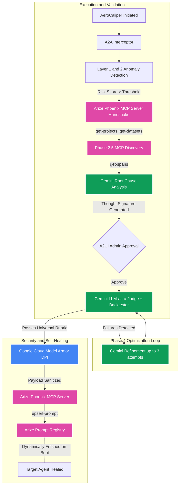

# System Architecture

The system implements a deterministic, multi-phase pipeline utilizing the Model Context Protocol (MCP) and large language models for autonomous AI governance and remediation.

Last audited: 2026-05-24, Version: v4.0 Universal

## End-to-End Pipeline Architecture

## 1. The A2A Interceptor

The architecture routes all LLM operations through the `A2AInterceptor` (`a2a_interceptor.py`).

Before any Gemini call is executed, the interceptor validates the agent's internal scoped identity (`remediate:write`, `mcp:connect`). If the intent violates the scope, the runtime rejects the request and logs the violation to the audit trail.

## 2. Intent-Driven Anomaly Detection

The system utilizes a two-layer anomaly scanner (`anomaly_detector.py`):
1. **Layer 1:** Deterministic regex pattern matching for predefined string sequences (e.g., `salary`, `pii`, `batch training job`).
2. **Layer 2:** LLM Intent Analysis. Uses Gemini to calculate a `risk_score` (0.0 to 1.0) and categorize the threat (FinOps vs. Privacy) prior to the MCP handshake.

The active `target_use_case` (`finops` or `hr`) is set at initialization and propagates through all phases, ensuring domain-specific filtering in the backtester and evaluator.

## 3. MCP Integration (Phase 2 & 2.5)

The system utilizes the Arize Phoenix MCP server for environment discovery and data retrieval via the official `modelcontextprotocol.io` Python SDK.

- **Phase 2 — MCP Handshake:** Spawns `@arizeai/phoenix-mcp` via `npx` using `StdioServerParameters` over JSON-RPC 2.0. The `baseUrl` is dynamically constructed from `ARIZE_SPACE_ID`, ensuring portability.
- **Phase 2.5 — MCP Environment Discovery:** Automatically profiles the workspace by executing `get-projects` and `get-datasets` to locate active project metrics and golden datasets for empirical backtesting.
- **Phase 3 — Trace Fetching:** Executes `get-spans` to retrieve the most recent failed execution trace. If the MCP tool returns an empty or error response, the system falls back to a native GraphQL query against the Phoenix API before failing closed.

## 4. Thought Signatures

When Gemini determines the root cause of the execution failure (e.g., "The target agent missed the `budget_tag` requirement"), it generates a candidate patch for the system prompt. This proposed patch is wrapped in a unique identifier token called a **Thought Signature** (`sig_vX_<hash>`).

This mechanism ensures state tracking: as the pipeline progresses into the Admin Approval Gate and LLM-as-a-Judge validation phase, the system verifies that the prompt text generated in Phase 3 matches the text deployed in Phase 5.

## 5. Empirical Backtesting & Phase 4 Optimization Loop

Phase 4 runs a multi-attempt Gemini optimization loop (up to **3 attempts**):

1. **Backtest Simulation:** Each case in `golden_dataset.csv` is filtered to the active domain (`finops` or `hr`) and simulated against the candidate prompt via a live Gemini call.
2. **Domain Evaluators:** Results are scored by `evaluate_finops_compliance()` or `evaluate_hr_compliance()` from `evaluators.py`.
3. **Pass Rate Calculation:** The pass rate is computed strictly over the filtered denominator. A 100% pass rate on attempt 1 short-circuits the loop.
4. **Gemini Refinement:** If any cases fail and attempts remain, the failure context (user prompt, verdict, output) is fed back to Gemini to generate a refined candidate prompt. The loop repeats until 100% or max attempts are reached.

## 6. A2UI Admin Approval Gate

After Phase 4 streams the candidate prompt to the admin dashboard, the pipeline **blocks** using `asyncio.Event()` for up to 5 minutes. The admin must click **Approve** (`POST /remediate/approve/{session_id}`) or **Reject** (`POST /remediate/reject/{session_id}`) via the SSE frontend. A rejection raises an exception and aborts the pipeline without deploying any changes.

## 7. LLM-as-a-Judge Validation

A separate Gemini session is initialized with a Universal Compliance Rubric (evaluating either Cloud FinOps or HR Privacy constraints based on the active domain). It acts as an LLM-as-a-Judge, running a boolean (`YES` or `NO`) check on the Thought Signature. Following machine-validation and A2UI approval, the `upsert-prompt` MCP tool executes to update the target agent.

## 8. Egress Security (Google Cloud Model Armor)

Before the final patch updates the Arize Prompt Registry, it passes through the **Agent Gateway** (`agent_gateway.py`). This gateway integrates the official `google-cloud-modelarmor` SDK to execute deep packet inspection (DPI) on the payload via `SanitizeUserPrompt` targeting the `us-central1` regional endpoint (`modelarmor.us-central1.rep.googleapis.com`).

**Strict Mode:** If the Model Armor SDK is unavailable or the GCP project/template are not configured, the gateway raises a `RuntimeError` immediately. There is no regex fallback or mock mode.

If a `GATEWAY_URL` environment variable is set, the system routes the payload to an external HTTP-triggered Cloud Function for distributed validation before the MCP upsert.
