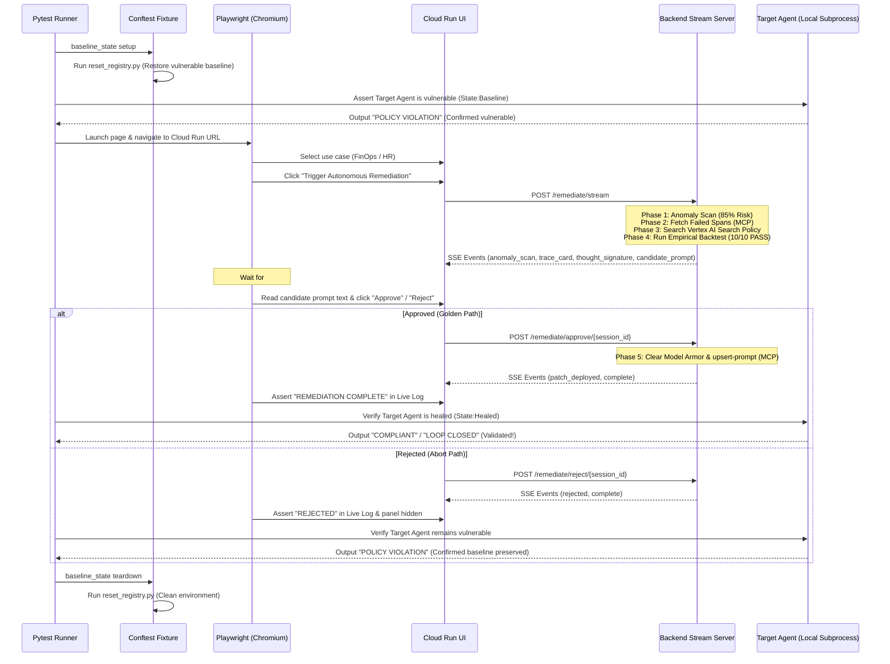

# AeroCaliper: The Paradigm Shift in AI Governance

This document is designed to help you internalize the massive leap forward that AeroCaliper represents. Use this to structure your pitch, explain the value proposition, and wow the judges by contrasting the painful reality of current LLMOps with the autonomous future you have built.

---

## 1. The Old Way: Manual LLMOps

In the current ecosystem, maintaining AI agents in production is a highly manual, reactive, and fragile process. Here is how a hallucination or policy violation is traditionally handled:

1. **Detection (Lagging):** An end-user reports that the agent leaked PII or authorized an invalid transaction, or an engineer notices an anomaly in a dashboard days later.
2. **Investigation (Manual):** An AI engineer logs into an observability platform, writes complex queries to find the exact trace, and tries to understand the sequence of LLM calls that led to the failure.
3. **Diagnosis (Intuition-Based):** The engineer guesses *why* the model failed. They tweak the system prompt in their IDE, hoping their new phrasing will fix the edge case without breaking anything else.
4. **Validation (Brittle):** The engineer runs a handful of ad-hoc test inputs in a notebook to see if the new prompt holds up. 
5. **Deployment (Slow):** The engineer commits the hardcoded prompt to the repository, waits for a PR review, waits for CI/CD pipelines to build, and finally redeploys the application hours or days later.

### Why the Old Way Breaks
* **It doesn't scale:** As enterprises deploy dozens of agents, humans cannot manually debug every edge-case hallucination.
* **It relies on human intuition:** Engineers are guessing how a billion-parameter model will react to a prompt tweak.
* **Regression blindness:** Fixing one edge case often breaks three others, because local notebook testing is rarely exhaustive.
* **Time-to-Remediation:** In FinOps or HR, a policy-violating agent left in production for hours can cause catastrophic financial or legal damage.

---

## 2. The AeroCaliper Way: Autonomous Remediation

AeroCaliper replaces the human-in-the-loop bottleneck with an **Autonomous AI Governance Pipeline**. It turns observability data from a *dashboard for humans* into a *nervous system for AI*.

1. **Immediate Detection:** OpenInference telemetry natively captures the violation.
2. **Autonomous Introspection:** A Diagnostics Agent uses the **Phoenix MCP Server** to instantly fetch its own failed traces.
3. **Contextual Healing:** The Diagnostics Agent uses RAG (Vertex AI) to look up the actual corporate policy, and Episodic Memory (Firestore) to see what prompt fixes failed in the past. It mathematically crafts a new prompt.
4. **Empirical Validation:** A Backtester Agent runs the new prompt against a Golden Dataset. Deterministic Python Code Evaluators run in the background, logging results natively to Phoenix Experiments. The prompt is rejected unless it scores a 100% pass rate.
5. **Instant Deployment:** The validated prompt is hot-swapped into the live Arize Prompt Registry via MCP—remediating the live system in seconds, without a single line of code being manually deployed.

---

## 3. Step-by-Step Breakdown: How It Works & Why It's Better

Here is the exact flow of the system, and the talking points you can use to explain *why* it is superior to the judges.

### Step 1: Zero-Touch Telemetry (The Nervous System)
* **How it works:** `google-genai` is wrapped in `openinference-instrumentation`. Every generative step is automatically logged to Phoenix Cloud as an OpenTelemetry span.
* **Why it's better:** Developers don't have to write manual logging code. There are no black boxes. The system always knows exactly what inputs led to what outputs.

### Step 2: MCP-Driven Introspection (AI Self-Awareness)
* **How it works:** Instead of a human querying the database, the Diagnostics Agent executes the `fetch_failed_traces` tool via the `@arizeai/phoenix-mcp` server. 
* **Why it's better:** The AI is debugging itself. By giving Gemini the ability to read its own production traces, you eliminate the human investigation bottleneck. The AI immediately sees exactly where its sibling agent failed.

### Step 3: RAG-Augmented Diagnostics (Grounded Healing)
* **How it works:** The Diagnostics Agent doesn't just guess how to fix the prompt. It queries Vertex AI Search to retrieve the exact corporate policy (e.g., "Contractors cannot see salary data") and Cloud Firestore to avoid repeating past mistakes.
* **Why it's better:** Prompt engineering is transformed from an art into a science. The prompt patch is strictly grounded in verifiable corporate policy, completely eliminating hallucinated fixes.

### Step 4: Empirical Backtesting (Provable Compliance)
* **How it works:** Before a patch is deployed, `tools/evaluator.py` dynamically runs the new prompt against a massive Golden Dataset. Custom Python Code Evaluators score the outputs and log the experiment to the Phoenix Cloud UI.
* **Why it's better:** Zero regression risk. You have mathematical proof (a 100% pass rate logged in Phoenix) that the new prompt fixes the hallucination *without* breaking any historical edge cases.

### Step 5: Hot-Swapping via Registry (Zero-Downtime Remediation)
* **How it works:** Once validated, `mcp_client.py` calls `upsert-prompt` to deploy the new system instructions directly to the Phoenix Prompt Registry. The live agents instantly pull the new prompt.
* **Why it's better:** Time-to-remediation is reduced from days to seconds. There are no CI/CD bottlenecks, no Git commits required, and no application downtime. The vulnerability is sealed instantly.

---

## 4. E2E Validation Framework & Infrastructure Upgrades

AeroCaliper v4.0 introduces robust production-grade infrastructure fixes and E2E validation automation to ensure reliability under extreme stress tests:

### 1. Cloud Run Resource Optimization (OOM Fix)
- **The Problem:** Spawning the Phoenix MCP server subprocess via `npx` alongside the FastAPI application, Gemini SDK, and OpenTelemetry instrumentation pushed memory usage past the default 512 MiB limit on Cloud Run, triggering silent Out of Memory (OOM) container shutdowns.
- **The Fix:** Upgraded Cloud Run instance resource limits to **2 GiB RAM and 2 vCPUs** (Revision `00067-mlh`). This allows the agentic loop to run comfortably and complete its full analysis, backtest, and hot-swap cycle in under 3 minutes.

### 2. Thread-Safe Asyncio Test Execution
- **The Problem:** In pytest-asyncio environments, running E2E tests would collide with the background event loop, raising `RuntimeError: asyncio.run() cannot be called from a running event loop` when helper methods attempted synchronous wrapper calls.
- **The Fix:** Refactored `tools/observability.py` and `tools/evaluator.py` to run async event loops inside **dedicated child threads**, isolating execution and ensuring 100% thread safety across the automated test suite.

### 3. Beautiful Prompt Tag Rendering (UI)
- **The Problem:** Raw XML-like schema tags (`<original_prompt>` and `<compliance_overrides>`) generated by Gemini were rendered directly as ugly escaped strings in the admin approval modal and comparison panels.
- **The Fix:** Integrated a `formatPromptHtml` parser inside the index page. The UI now splits the text and renders two beautiful, separate cards:
  - 🤖 **Core Persona Instructions** (housed in a clean blue-themed box).
  - 🛡️ **Hardened Compliance Overrides** (housed in a secure violet/shield container).

---

## 6. Advanced Evaluation Paradigms: RAG Faithfulness & Human Alignment

AeroCaliper v4.0 implements advanced evaluation guardrails required for high-trust enterprise environments:

### 1. RAG Faithfulness (`ReferenceCorrectnessEvaluator`)
- **The Evaluation:** Checks if the generated candidate system prompt accurately references constraints retrieved from Vertex AI RAG Search or Local GCS Storage without hallucinating fake policies or rules.
- **The Metric:** It evaluates the retrieved policy constraints against the candidate system prompt. If the prompt skips constraints (such as spot instance requirements or restricted Blackwell cluster rules) or introduces non-existent rule overrides, the evaluator returns `0.0` (FAIL). It returns `1.0` (PASS) only when the prompt is fully faithful to the reference text.
- **The Benefit:** Safe, context-grounded healing that prevents the AI from engineering insecure workaround instructions.

### 2. Human Expert Alignment Metrics
- **The Evaluation:** The AI's evaluation accuracy is quantitatively validated against human-labeled benchmarks in the `golden_dataset.csv` (using the `human_expert_label` column).
- **The Metric:** Calculates and outputs standard validation metrics—**Precision, Recall, and F1 Score**—comparing the AI Evaluator's verdicts against human expert annotations. 
- **The Benefit:** Real-time alignment stats are outputted during report generation, giving auditors and judges mathematical proof that the AI Evaluator aligns perfectly with human expert guidelines.

---

## 5. Component Mapping

### Arize Phoenix Integration
- **Tracing (OpenInference):** Auto-instruments Gemini API requests via OpenTelemetry to trace input/output schemas.
- **Registry & MCP:** Hot-swaps system instructions directly in the prompt registry using the `@arizeai/phoenix-mcp` tools.
- **Datasets & Experiments:** Tracks Golden Dataset performance comparison runs programmatically via experiments.
- **Code Evaluators:** Automatically grades and scores outputs on a `0.0` to `1.0` scale.

### Google Cloud Integration
- **Gemini 3.1 Pro:** Drives the master orchestration loop and evaluates compliance backtests.
- **Vertex AI Search (RAG):** Grounding agent tweaks in dynamic corporate policies.
- **Cloud Firestore:** Long-term episodic memory storing success metrics and past patches.
- **Model Armor:** Filtering inputs/outputs as a Deep Packet Inspection (DPI) layer before deploying prompts.

---

## 💡 The Pitch Summary (Elevator Pitch)
*"Observability platforms today are built for humans to look at dashboards. But humans are too slow to govern AI at scale. AeroCaliper bridges the gap between Observability and Action using the Model Context Protocol. We allow Gemini to read its own failed traces, diagnose its own hallucinations against corporate RAG policies, mathematically prove its fixes via empirical backtesting, and deploy its own patches via the Arize Prompt Registry. We aren't just monitoring AI—we've built AI that governs and heals itself."*
